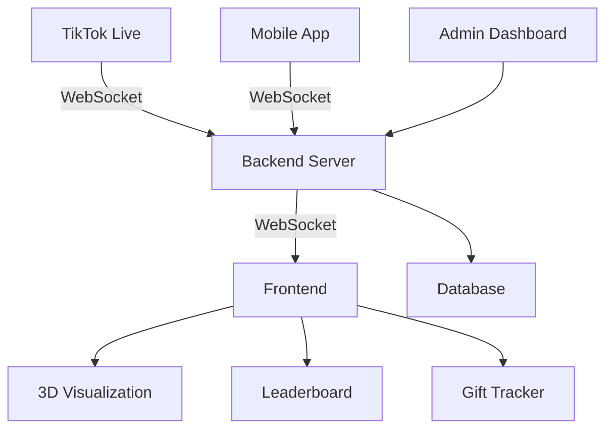

# Hyperfocus Gift Engine - Architecture Overview

## 🏗️ System Architecture



## 📁 Project Structure

```
hypefocus-gift-engine/
├── src/                      # Source code
│   ├── components/           # React components
│   │   ├── Alerts/          # Gift alerts and notifications
│   │   ├── Analytics/       # Data visualization
│   │   ├── BROskiShop/      # In-app store
│   │   ├── Dashboard/       # Main dashboard components
│   │   ├── GiftGoalTracker/ # Gift tracking components
│   │   ├── Leaderboard/     # User rankings
│   │   └── TapBattle/       # Interactive battle system
│   │
│   ├── hooks/               # Custom React hooks
│   ├── store/               # State management
│   ├── styles/              # Global styles and themes
│   └── utils/               # Utility functions
│
├── public/                  # Static assets
├── docs/                    # Documentation
└── tests/                   # Test files
```

## 🧩 Core Components

### 1. Backend Services
- **WebSocket Server**: Handles real-time communication
- **TikTok Live API**: Integrates with TikTok's live streaming API
- **Database Layer**: Manages user data and gift history
- **Authentication**: Handles user sessions and API keys

### 2. Frontend Components

#### 2.1 3D Visualization Engine
- Built with Three.js and React Three Fiber
- Handles gift animations and effects
- Optimized for WebGPU/WebGL

#### 2.2 Gift Processing
- Real-time gift event handling
- Gift value calculation
- Combo and streak detection

#### 2.3 User Interface
- Responsive design with Tailwind CSS
- Dark/light theme support
- Accessibility features

## 🔄 Data Flow

1. **Gift Received**:
   - TikTok Live → WebSocket Server → Frontend → 3D Engine
   - Triggers animations and updates leaderboard

2. **User Interaction**:
   - User action → State update → UI re-render
   - Persists to database if needed

3. **Analytics**:
   - Frontend events → Analytics service → Dashboard

## 🛠️ Tech Stack

### Frontend
- **Framework**: React 19
- **3D Rendering**: Three.js, React Three Fiber
- **State Management**: React Context + Hooks
- **Styling**: Tailwind CSS
- **Build Tool**: Vite

### Backend
- **Runtime**: Node.js
- **WebSocket**: ws
- **API**: Express
- **Database**: MongoDB (with Mongoose)

### Testing
- **Unit Tests**: Jest
- **E2E Tests**: Playwright
- **Visual Testing**: Storybook

## 🚀 Deployment

### Development
```bash
# Start dev server
npm run dev

# Run tests
npm test
```

### Production
```bash
# Build for production
npm run build

# Start production server
npm start
```

## 📊 Performance Metrics

| Metric                  | Target        |
|-------------------------|---------------|
| Time to Interactive    | < 3s          |
| First Contentful Paint | < 1.5s        |
| Web Vitals (LCP)       | < 2.5s        |
| WebSocket Latency      | < 100ms       |
| Animation FPS          | 60 FPS (min)  |

## 🔒 Security

- JWT Authentication
- Rate Limiting
- CORS Configuration
- Input Sanitization
- CSRF Protection

## 📈 Scaling

### Horizontal Scaling
- Stateless WebSocket servers
- Redis for pub/sub
- Load balancing with Nginx

### Caching
- Client-side caching
- CDN for static assets
- Database query caching

## 🔄 CI/CD Pipeline

1. **On Push to Main**:
   - Run tests
   - Build production bundle
   - Deploy to staging

2. **On Tag**:
   - Create release
   - Deploy to production
   - Run smoke tests

## 📚 Documentation

- [API Documentation](./api/README.md)
- [Developer Guide](./developers/ONBOARDING.md)
- [Deployment Guide](./deployment/README.md)
- [Troubleshooting](./troubleshooting/README.md)

## 🚀 Future Improvements

- [ ] Implement WebRTC for peer-to-peer streaming
- [ ] Add support for custom gift effects
- [ ] Integrate with more streaming platforms
- [ ] Advanced analytics dashboard
- [ ] Mobile app optimizations

## 📝 License

MIT License - See [LICENSE](./LICENSE) for details.
